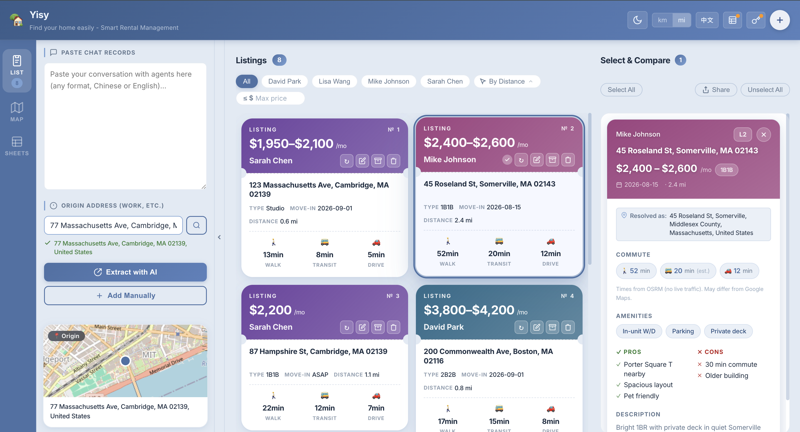

# Yisy · 找房很容易

**[English](#yisy---find-your-home-easily) · [中文](#yisy---找房很容易)**

---

# Yisy - Find your home easily!

A personal rental listing manager. Paste chat logs with agents and let AI extract listings automatically, calculate commute times from your origin (workplace, etc.), view listings on a map, and sync everything to Google Sheets.

## Preview

| Card View | Map View |
|---|---|
|  |  |

## Features

- **AI Extraction** — Paste agent chat logs; automatically parses address, unit type, rent, amenities, and more
- **Manual Entry** — Add listings by hand
- **Select & Compare** — Select multiple listings to view their full details side-by-side
- **Share** — Copy selected listings as formatted text, or download a PDF via the browser print dialog
- **Commute Calculation** — Walking, driving, and estimated transit times from your origin (powered by OSRM)
- **Filter & Sort** — Filter by agent or max price; sort by distance
- **Archive** — Archive listings you're no longer considering without deleting them
- **Map View** — See all listings on an interactive map
- **Google Sheets Sync** — Data syncs to Google Sheets ~1.5 s after each change
- **Dark Mode / Language Toggle** — Chinese & English UI

## Quick Start

### 1. Install dependencies

```bash
npm install
```

### 2. Start dev server

```bash
npm run dev
```

### 3. (Optional) Set Anthropic API Key

Required only if you want to use **AI extraction** — paste a chat log and have the app automatically parse listings. If you add listings manually, no API key is needed.

Click the key icon in the top-right corner and enter your `sk-ant-...` key. The key is stored only in your local browser.

Get a key at [console.anthropic.com](https://console.anthropic.com)

### 4. (Optional) Google Sheets Sync

Without this, data is stored in browser localStorage and will be lost if the browser data is cleared.

**Deploy the Apps Script:**

1. Create a new Google Sheets spreadsheet
2. Extensions → Apps Script
3. Paste the contents of [google-apps-script.gs](google-apps-script.gs) and save
4. Deploy → New deployment → Type: **Web app**
   - Execute as: **Me**
   - Who has access: **Anyone**
5. Copy the deployment URL

**Connect to the app:**

Click the spreadsheet icon in the top-right corner, paste the deployment URL, and click "Save & Connect".

> On first connect, if Google Sheets is empty, local data is automatically migrated.

## Tech Stack

| Layer | Technology |
|---|---|
| Framework | React 18 + Vite 5 |
| Map | Leaflet + react-leaflet |
| AI Extraction | Anthropic API (claude-sonnet-4-6) |
| Geocoding | Nominatim (OpenStreetMap) |
| Routing | OSRM (router.project-osrm.org) |
| Storage | localStorage (default) / Google Sheets (optional) |

## Build

```bash
npm run build
```

Output is in `dist/` — deploy as a static site.

## Notes

- The Anthropic API key is sent directly from the browser — enable `dangerous-direct-browser-access` in the Anthropic console
- Transit commute times are estimated from straight-line distance, not real-time data
- OSRM routing may differ from Google Maps and does not include live traffic


---

# Yisy - 找房很容易

个人租房信息管理工具。将与中介的聊天记录粘贴进来，由 AI 自动提取房源信息，并计算与原点（工作地等）的距离和通勤时间，支持地图查看和 Google Sheets 同步。

## 预览

| 卡片视图 | 地图视图 |
|---|---|
|  |  |

## 功能

- **AI 提取**：粘贴与中介的聊天记录，自动解析房源地址、户型、租金、配套设施等信息
- **手动添加**：支持手动录入房源
- **选择对比**：选中多个房源，并排查看完整详情
- **分享**：将选中房源复制为格式化文本，或通过浏览器打印对话框下载为 PDF
- **通勤计算**：自动计算距原点的步行、驾车、公交时间（基于 OSRM，公交为估算值）
- **筛选与排序**：按中介或最高租金筛选，按距离排序
- **归档**：将暂不考虑的房源归档，无需删除
- **地图视图**：在地图上查看所有房源分布
- **Google Sheets 同步**：数据实时同步到 Google Sheets，每次变化后约 1.5 秒写入
- **深色模式 / 中英文切换**

## 快速开始

### 1. 安装依赖

```bash
npm install
```

### 2. 启动开发服务器

```bash
npm run dev
```

### 3.（可选）配置 Anthropic API Key

仅在使用 **AI 提取**功能时需要——将聊天记录粘贴后由 AI 自动解析房源。如果只手动添加房源，无需配置。

点击右上角钥匙图标，输入 `sk-ant-...` 格式的 Key。Key 仅存储在本地浏览器中。

获取地址：[console.anthropic.com](https://console.anthropic.com)

### 4.（可选）配置 Google Sheets 同步

不配置时数据存储在浏览器 localStorage，清除浏览器数据会丢失。

**部署 Apps Script：**

1. 新建一个 Google Sheets 表格
2. 扩展程序 → Apps Script
3. 将 [google-apps-script.gs](google-apps-script.gs) 的内容粘贴进去，保存
4. 部署 → 新建部署 → 类型选「网络应用」
   - 执行身份：**我（你的账号）**
   - 访问权限：**所有人**
5. 复制部署 URL

**连接到应用：**

点击右上角表格图标，粘贴部署 URL，点击「保存并连接」。

> 首次连接时，若 Google Sheets 为空，本地数据会自动迁移到 GS。

## 技术栈

| 层 | 技术 |
|---|---|
| 框架 | React 18 + Vite 5 |
| 地图 | Leaflet + react-leaflet |
| AI 提取 | Anthropic API（claude-sonnet-4-6） |
| 地理编码 | Nominatim（OpenStreetMap） |
| 路线计算 | OSRM（router.project-osrm.org） |
| 存储 | localStorage（默认）/ Google Sheets（可选） |

## 构建

```bash
npm run build
```

产物在 `dist/` 目录，可直接作为静态网页部署。

## 注意事项

- Anthropic API Key 直接从浏览器发起请求，需在 Anthropic 控制台开启 `dangerous-direct-browser-access`
- 公交通勤时间为基于直线距离的估算值，非实时数据
- OSRM 路线数据可能与 Google Maps 有差异，不含实时路况
